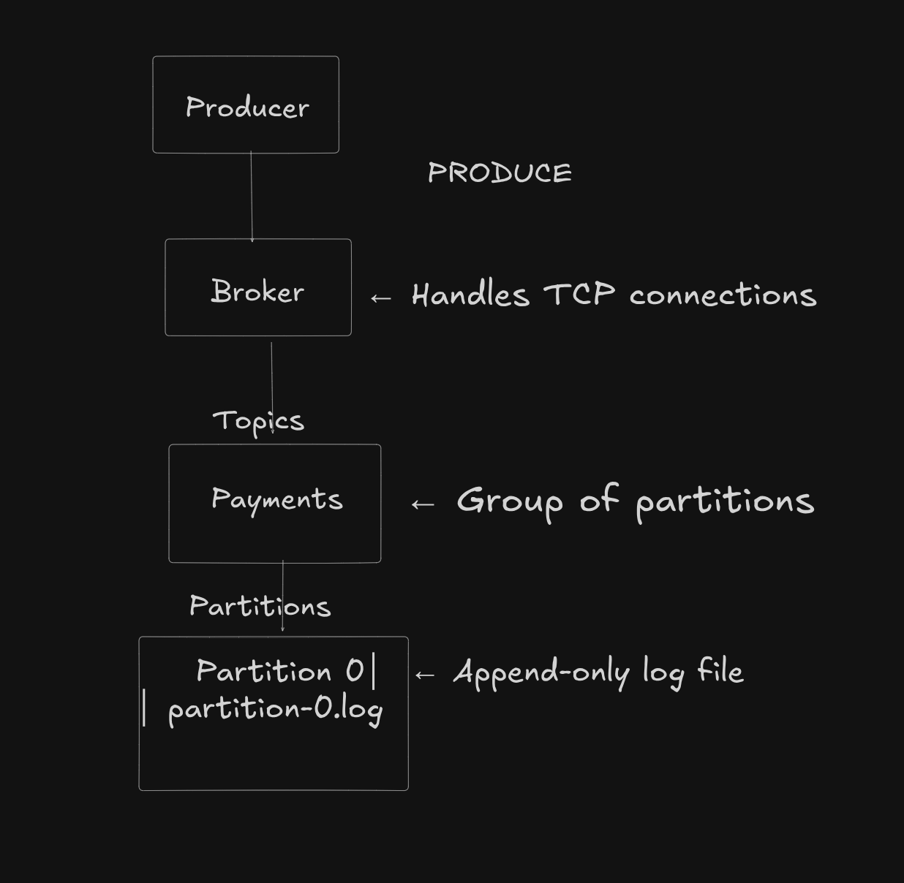

# 🦀 Rafka — A Distributed Commit Log in Rust

**Rafka** is a lightweight, educational re-implementation of **Apache Kafka** written in **Rust**, built from the ground up to understand how distributed commit logs work.
It aims to explore the internal mechanics of Kafka — including durability, partitioning, offsets, replication, and fault-tolerant message delivery.

---

## 🚀 Overview

Rafka is not a library — it’s a *learning project* that mimics the essential building blocks of Kafka’s architecture:

* Persistent **append-only commit log** stored on disk
* Topic-based message organization
* **Partitions** for scalability and ordering
* **Producers** that append records
* **Consumers** that read from offsets
* A simple **TCP-based broker** handling commands like `PRODUCE` and `CONSUME`

---

## 🎯 Project Goals

* 🧱 Build a **durable append-only log** for message persistence
* ⚙️ Implement **topic** and **partition management**
* 🔁 Add **replication** and leader election (in future versions)
* 📨 Support a basic **producer–consumer protocol** over TCP
* 🧠 Deeply understand Kafka’s internals —
  such as **segment files**, **indexes**, **message formats**, **commit logs**, and **offset tracking**

---

## 🧩 Current Features

✅ In-memory topic management with file-based log persistence
✅ Partitioned message storage (1..N partitions per topic)
✅ `PRODUCE` / `CONSUME` TCP commands
✅ Offset-based message reading
✅ Thread-safe broker using `Arc<Mutex<_>>`
✅ Disk-backed logs under `data/<topic>/partition-*.log`
✅ Testable with simple clients like `nc` or a custom Rust client

---

## 🧠 Example Usage

### Start the Broker

```bash
cargo run
```

Output:

```
Broker Listening on 127.0.0.1:9092
Topic Created: Payments
```

### Produce a Message

```bash
    nc 127.0.0.1 9092
    "PRODUCE Payments key1 HelloWorld"
```

### Consume Messages

```bash
    nc 127.0.0.1 9092
    "CONSUME Payments 0 0" 
```

---

## 🧱 Architecture


---

## 🧪 Planned Enhancements

| Feature                     | Description                                    |
| --------------------------- | ---------------------------------------------- |
| 🧮 Round-Robin Partitioning | Distribute messages across partitions          |
| 📈 Consumer Offset Tracking | Resume consumption from last offset            |
| 🗃️ Segment + Index Files   | Implement segment rotation & indexing          |
| ⚡ Replication               | Add multiple brokers with leader election      |
| 🧰 CLI Tools                | Rust-based producer and consumer clients       |
| 🔒 Error Handling           | Graceful shutdown and better protocol handling |

---

## 🦾 Tech Stack

* **Language:** Rust
* **Concurrency:** Threads + `Arc<Mutex>`
* **Networking:** `std::net::TcpListener` / `TcpStream`
* **Persistence:** File I/O (append-only logs)

---

## 🧑‍💻 Why Build Rafka?

Kafka is complex — but the core idea is simple: a distributed, persistent log.
Rafka is a hands-on way to **understand the foundations** of distributed systems, message durability, and data streaming from a system-level perspective in Rust.

---

## 📜 License

MIT © 2025 — Built by [@OmSharma42306](https://github.com/OmSharma42306) 🦀
